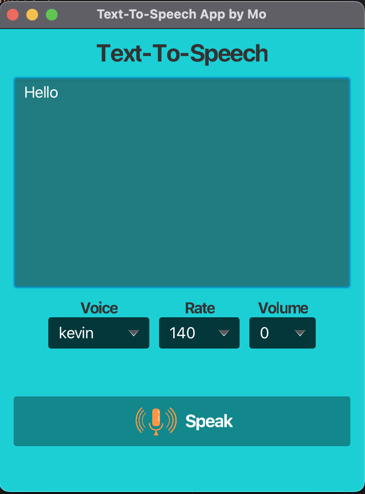
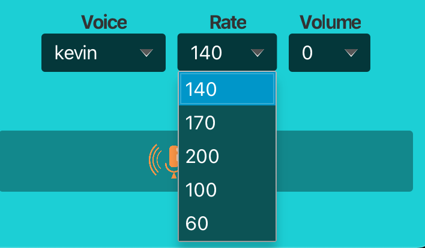
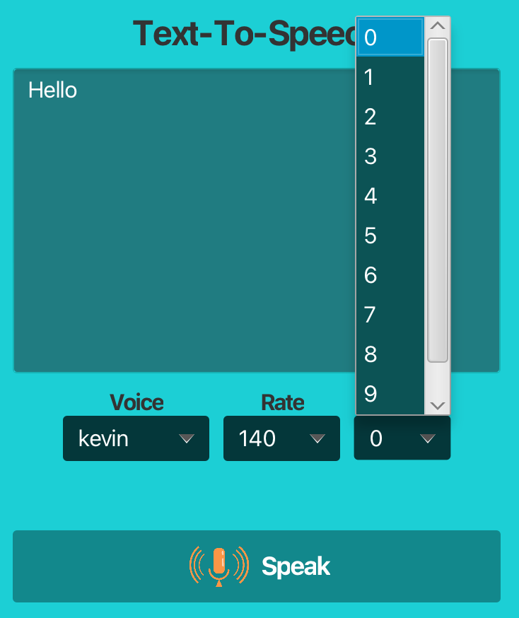

# Text-To-Speech GUI Application

Welcome to the **Text-To-Speech GUI Application**! This is a JavaFX application that converts text input into speech using the FreeTTS library.

## Features

- **Text Input:** Type your text into the text area.
- **Voice Selection:** Choose from a list of available voices.
- **Rate Adjustment:** Select the speech rate (e.g., normal, fast, slow).
- **Volume Control:** Adjust the speech volume (0-10).
- **Speak Button:** Converts the text to speech based on selected settings.

## Screenshots

Below are some screenshots of the application:





## Getting Started

### Prerequisites

- **Java Development Kit (JDK) 21** or later
- **Maven** (for dependency management and building)
- **FreeTTS** library (included as a Maven dependency)

### Installation

1. **Clone the Repository:**

    ```bash
    git clone https://github.com/MohamedBoulhen/TextToSpeechGui.git
    ```

2. **Navigate to the Project Directory:**

    ```bash
    cd TextToSpeechGui
    ```

3. **Build the Project Using Maven:**

    ```bash
    mvn clean install
    ```

4. **Run the Application:**

    ```bash
    mvn javafx:run
    ```

## Usage

1. **Open the Application:** Run the application using the Maven command provided above.
2. **Enter Text:** Type your desired text into the text area.
3. **Select Settings:** Choose your preferred voice, rate, and volume from the dropdown menus.
4. **Click "Speak":** Click the "Speak" button to hear the text spoken aloud.

## Configuration

The application uses FreeTTS for text-to-speech functionality. The `TextToSpeechController` class is configured to use the `KevinVoice` from the FreeTTS library. Modify the system properties if you need different voices.

## Project Structure

- `src/main/java/com/example/texttospeechgui/` - Contains the main application code.
  - `TextToSpeechGui.java` - JavaFX application entry point and GUI setup.
  - `TextToSpeechController.java` - Handles text-to-speech operations.
- `src/main/resources/` - Contains resources such as CSS files and images.
- `pom.xml` - Maven configuration file.

## Troubleshooting

- **No Voices Available:** Ensure the FreeTTS library is correctly configured and that the voice directory is accessible.
- **Missing Files:** Verify that all required files (e.g., images, CSS) are correctly placed in the `resources` directory.

## Contributing

Contributions are welcome! Please submit issues or pull requests on the [GitHub repository](https://github.com/MohamedBoulhen/TextToSpeechGui).

## License

This project is licensed under the MIT License - see the [LICENSE](LICENSE) file for details.

## Acknowledgements

- [JavaFX](https://openjfx.io/) for the graphical user interface framework.
- [FreeTTS](http://freetts.sourceforge.net/docs/index.php) for the text-to-speech functionality.
